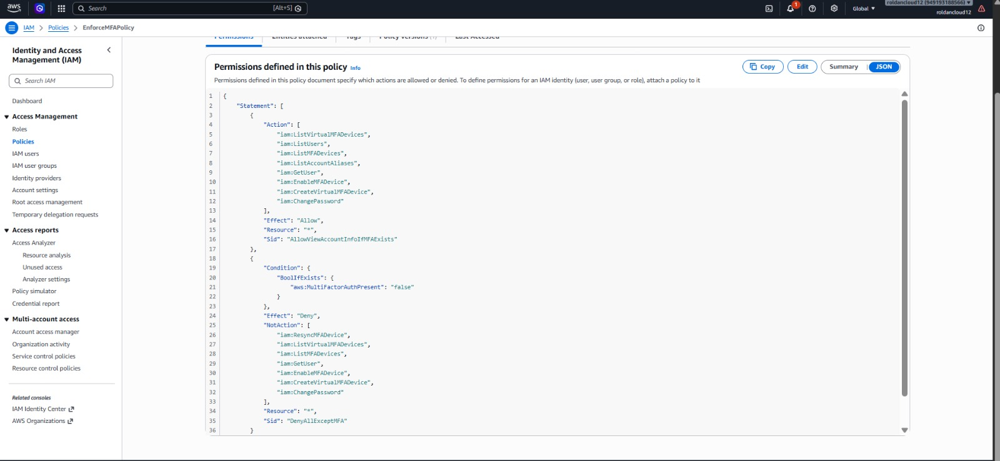
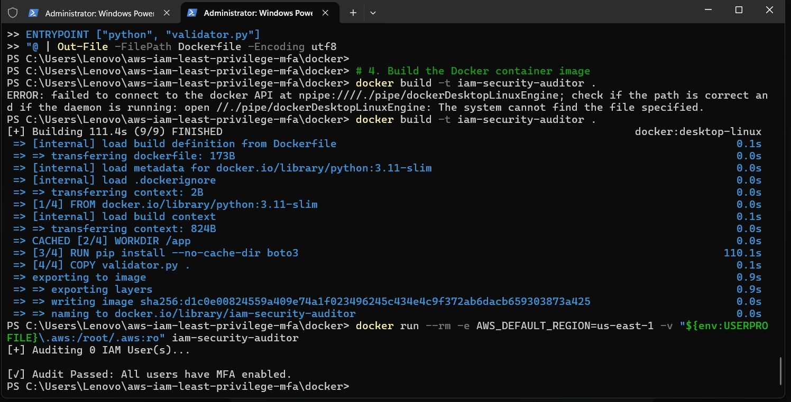

# AWS IAM Least-Privilege & MFA Policy Automation

An automated Infrastructure as Code (IaC) security implementation provisioning IAM least-privilege controls, explicit MFA enforcement policies, and containerized compliance auditing.

## Architecture & Workflow
1. **Terraform IaC**: Provisions IAM Groups and attaches forced Multi-Factor Authentication conditions (\EnforceMFAPolicy\).
2. **Containerized Audit Tool**: A Python script running inside Docker evaluates IAM users and detects non-compliant accounts lacking active MFA devices.
3. **Continuous Integration**: GitHub Actions executes \	erraform fmt\, \	erraform validate\, and static security analysis with \	fsec\.

## Repository Structure
\\\	ext
aws-iam-least-privilege-mfa/
+-- .github/workflows/terraform-ci.yml
+-- docker/
¦   +-- Dockerfile
¦   +-- validator.py
+-- docs/screenshots/
+-- terraform/
¦   +-- main.tf
¦   +-- variables.tf
+-- README.md
\\\`n
## Verification Screenshots
### Explicit MFA Enforcement Policy in AWS Console

### Dockerized Security Auditor Execution Output

